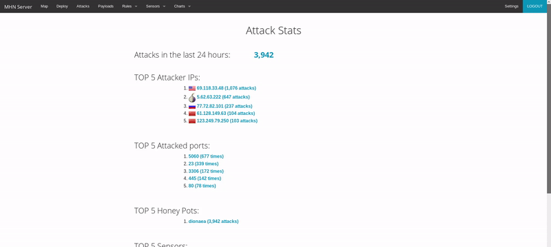

# WebSecurity-Weeks-10-11-Project-Honeypot

**Time spent: 27 Hours**

# Honey Pot
A honeypot is a decoy application, server, or other networked resource that intentionally exposes insecure features which, when exploited by an attacker, will reveal information about the methods, tools, and possibly even the identity of that attacker. Honeypots are commonly used by security researchers to understand the threat landscape facing developers and system adm
inistrators, collecting data that might include
   * Information about sources of malicious network traffic such as IP addresses, geographic origin, targeted ports, etc.
   * Information used to harden resources against email spammers
   * Malware samples
   * DB vulnerabilities such as SQLI techniques
   
There are two broad categories of honeypots:
   * **Low-interaction honeypots** provide simulations of target resources, typically using emulation or virtualization, to reduce resource consumption, simplify configuration and deployment, and provide solid containment features.
   * **High-interaction honeypots** expose non-simulated target resources in a way that more closely imitates a production environment to attract more sophisticated attackers and understand more complicated exploitation routes.
   
# A summary of the data collected:

Number of attacks: 12543 TOP 5 Attacker IPs:
  * 69.118.33.48 : (1,076 attacks)
  * 5.62.63.222 : (649 attacks)
  * 77.72.82.101 : (237 attacks)
  * 61.128.149.63 : (99 attacks)
  * 123.249.79.250 : (86 attacks)
  
TOP 5 Attacked ports (Dionaea):
  * 5060 (678 times)
  * 23 (337 times)
  * 3306 (155 times)
  * 445 (146 times)
  * 80 (78 times)

